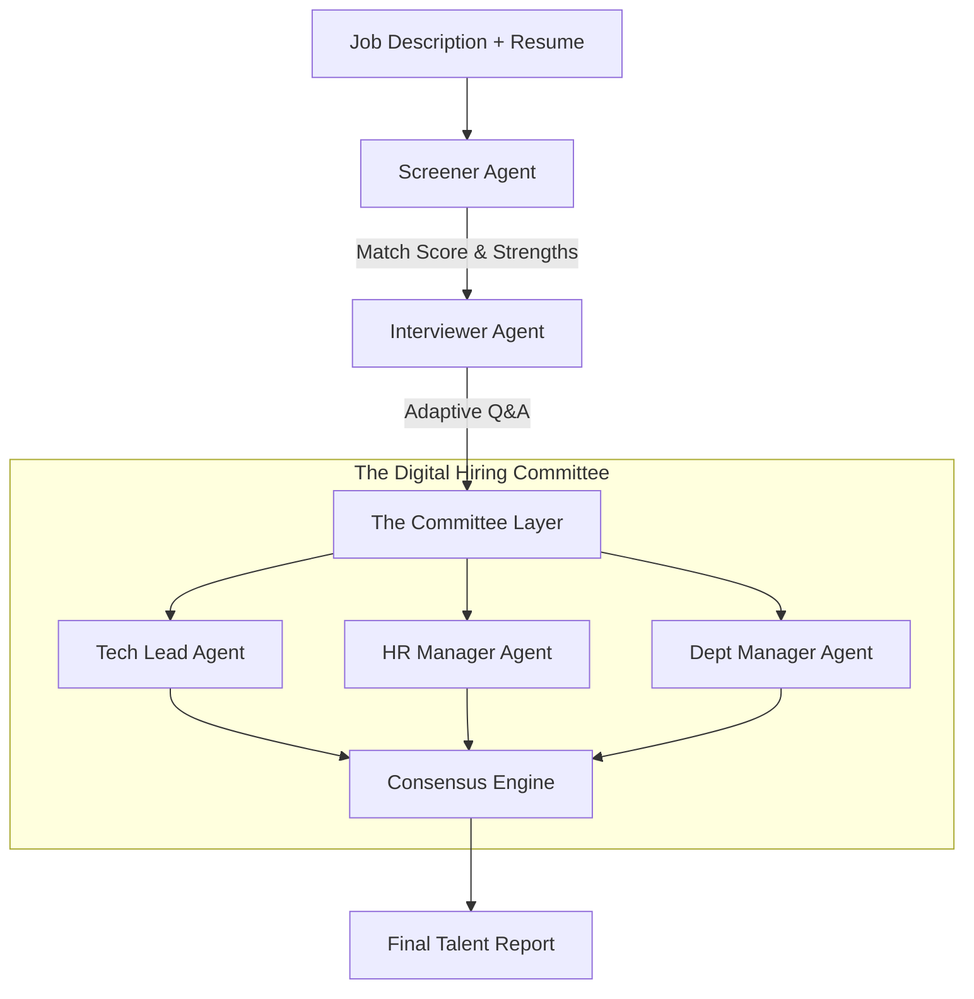

# TalentStream AI 🚀

**Autonomous Multi-Agent Hiring & Interviewing System**

---

## 🔥 The Unique Idea
**TalentStream AI** isn't just another resume parser. It is an autonomous recruitment ecosystem that simulates a **real-world hiring pipeline.** Instead of relying on a single model's output, it employs a **"Digital Hiring Committee"** of specialized AI agents that collaborate, debate, and reason together to move a candidate from application to a final data-driven hiring decision.

---

## 🧠 System Architecture

The system operates on an **Orchestrated Agentic Workflow** using LangGraph/CrewAI. For a deep dive into the multi-agent reasoning logic, see our [Full Architecture Documentation](docs/architecture.md).



### The Pipeline:
1. **Ingestion Layer**: Multi-format (PDF/Text) parsing of JD and Resumes.
2. **Screening Agent**: Performs a "Deep Match" between requirements and experience, identifying "weak spots" for the next phase.
3. **The Interviewer (Interactive Agent)**: A dynamic chat interface that probes specific claims rather than following a fixed script.
4. **The Committee (Debate Layer)**: The interview transcript is analyzed from three distinct perspectives (Technical depth, Culture fit, and ROI).
5. **Consensus Engine**: Agents resolve conflicts and output a data-driven, synthesized "Talent Report."

---

## 🚀 Week 1 Screener Demo: Sample Output

When the **Screener Agent** evaluates a candidate, it produces structured intelligence for the Hiring Committee:

```json
{
  "match_score": 85,
  "summary": "Strong candidate for the Senior Python Engineer role with 5+ years of experience in FastAPI and distributed systems.",
  "strengths": [
    "Expertise in asynchronous programming",
    "Proven track record with scalable microservices",
    "Strong understanding of CI/CD pipelines"
  ],
  "areas_to_probe": [
    "Experience with Kubernetes is mentioned but lacks specific project details.",
    "Verify the depth of their contributions to the open-source projects listed."
  ],
  "recommendation": "Highly Recommended for the Interview Phase"
}
```

---

## 🧩 Project Structure
- `agents/`: Core logic for specialized AI agents (Screener, Tech Lead, etc.).
- `api/`: FastAPI backend for the recruiter dashboard.
- `docs/`: Personas, technical diagrams, and project documentation.
- `tests/`: Unit and integration tests for agent logic.
- `main.py`: CLI entry point for the Week 1 Screener Demo.

## 🛠️ Tech Stack
- **AI Framework**: CrewAI / LangGraph
- **LLMs**: Gemini 1.5 Pro & Groq (Llama 3)
- **Backend**: FastAPI (Python)
- **Frontend**: Next.js (Tailwind CSS)
- **Database**: PostgreSQL & Pinecone

## 🚀 Getting Started (Week 1)
1. Install dependencies:
   ```bash
   pip install -r requirements.txt
   ```
2. Run the Screener Demo:
   ```bash
   python main.py
   ```
