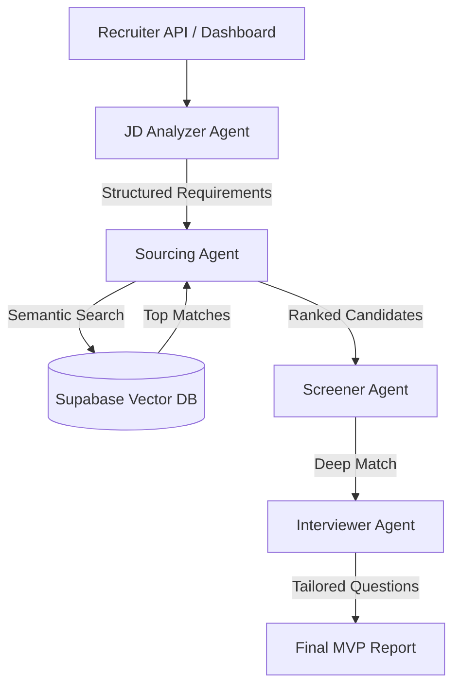

# TalentStream AI 🚀

**Autonomous Multi-Agent Hiring & Interviewing System**

---

## 🔥 The Unique Positioning (Top 1% Strategy)
**TalentStream AI** is an autonomous recruitment ecosystem that simulates a **real-world hiring pipeline.** Instead of relying on a single model's output, it employs a **"Digital Hiring Committee"** of specialized AI agents that collaborate, debate, and reason together to move a candidate from application to a final data-driven hiring decision.

### Week 4 Milestone: The Linear MVP Checkpoint
For the mid-term milestone (Week 4), we have achieved a fully functional **Linear Talent Pipeline**. The system can now autonomously transition a requirement from a raw JD to a candidate-specific interview plan.

---

## 🧪 Week 4 Milestone: End-to-End Evaluation Demo

The system generates a comprehensive **Talent Intelligence Report** via a single pipeline:

```text
━━━━━━━━━━━━━━━━━━━━━━━━━━━━━━━━━━━━━━━━━━━━━━━━━━━━━━━━━━━━━━━
           TALENT INTELLIGENCE REPORT - FINAL MVP
━━━━━━━━━━━━━━━━━━━━━━━━━━━━━━━━━━━━━━━━━━━━━━━━━━━━━━━━━━━━━━━
CANDIDATE: Jane Doe
MATCH PROBABILITY: 90%

💪 KEY STRENGTHS:
  ● Deep proficiency in Python (FastAPI) and React
  ● Proven track record in building production-ready RAG systems
  ● Strong understanding of architectural scalability

🎯 STRATEGIC INTERVIEW QUESTIONS:
  1. Describe a recent project where you had to optimize the performance of a React application. What specific optimizations did you implement?
  2. How do you handle errors and exceptions when integrating with Large Language Models (LLMs)?
  3. Design a high-level architecture for a scalable web application that utilizes LLMs.
  4. Can you explain the differences between FastAPI and Django for high-concurrency tasks?
  5. Walk me through your process for debugging issues with LLM-based RAG pipelines.

💡 INTERVIEWER GUIDANCE:
  Pay close attention to her ability to provide first-principles architectural reasoning. Watch for signs of keyword stuffing and press for specific implementation details.
━━━━━━━━━━━━━━━━━━━━━━━━━━━━━━━━━━━━━━━━━━━━━━━━━━━━━━━━━━━━━━━
FINAL RECOMMENDATION: HIRE / PROCEED
━━━━━━━━━━━━━━━━━━━━━━━━━━━━━━━━━━━━━━━━━━━━━━━━━━━━━━━━━━━━━━━
```

---

## 🧠 System Architecture

The system operates on an **Orchestrated Agentic Workflow** using CrewAI and LangGraph.



### The Pipeline:
1.  **JD Analyzer Agent**: Extracts structured requirements from raw job descriptions.
2.  **Sourcing Agent**: Performs semantic search across the **Vector DB** to find best-fit talent.
3.  **Screening Agent**: Performs a "Deep Match" between requirements and candidate experience.
4.  **Interviewer Agent**: Generates 5 strategic, non-googlable questions tailored to the candidate's gaps.

---

## 🧩 Project Structure
- `agents/`: Core logic for specialized AI agents (`jd_analyzer_agent.py`, `screener_agent.py`, `sourcing_agent.py`, `interviewer_agent.py`).
- `api/`: FastAPI backend implementation and REST endpoints.
- `ingest_resumes.py`: Utility to parse and index resumes into the Vector DB.
- `main.py`: CLI entry point for the Full End-to-End MVP Demo.

## 🛠️ Tech Stack
- **Orchestration**: CrewAI / LangGraph
- **LLMs**: Gemini 1.5 Pro & Groq (Llama 3)
- **Embeddings**: HuggingFace Local (Free & Private)
- **Database**: PostgreSQL + pgvector (Supabase)

## 🚀 Getting Started (Week 4 Milestone)

### 1. Run the Full MVP Demo (CLI)
```bash
python main.py
```

### 2. Run the Evaluation API
```bash
uvicorn api.main:app --reload
```
Test the new `POST /evaluate-candidate` endpoint in the Swagger UI to see the full end-to-end reasoning in action.
