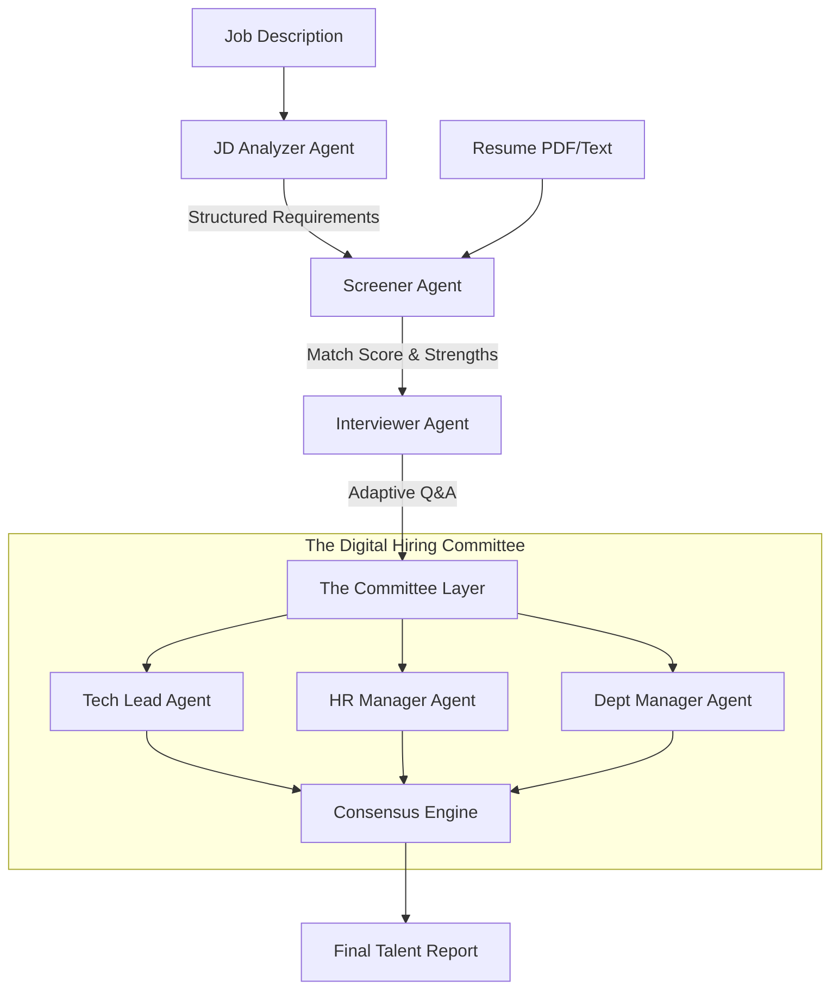

# TalentStream AI 🚀

**Autonomous Multi-Agent Hiring & Interviewing System**

---

## 🔥 The Unique Positioning (Top 1% Strategy)
**TalentStream AI** isn't just another resume parser. It is an autonomous recruitment ecosystem that simulates a **real-world hiring pipeline.** Instead of relying on a single model's output, it employs a **"Digital Hiring Committee"** of specialized AI agents that collaborate, debate, and reason together to move a candidate from application to a final data-driven hiring decision.

### Week 1 Progress: The Digital Screener Pipeline
For the Week 1 milestone, we have implemented a **Multi-Agent Screening Pipeline**. Unlike basic keyword matchers, our system uses two specialized agents:
1.  **Technical Hiring Strategist (JD Analyzer):** Breaks down complex JDs into structured "Must-Haves," Tech Stacks, and Soft Skills.
2.  **Expert Technical Recruiter (Screener Agent):** Performs a "Deep Match" between the candidate and the *structured requirements* extracted by the first agent.

---

## 🧪 Week 1 Milestone: Multi-Agent Screening Demo

The system now generates a professional **Talent Intelligence Report** by orchestrating multiple agents:

```text
━━━━━━━━━━━━━━━━━━━━━━━━━━━━━━━━━━━━━━━━━━━━━━━━━━━━━━━━━━━━
           TALENT INTELLIGENCE REPORT - SCREENER
━━━━━━━━━━━━━━━━━━━━━━━━━━━━━━━━━━━━━━━━━━━━━━━━━━━━━━━━━━━━
ROLE: Senior Full-Stack Engineer (AI focus)
MATCH PROBABILITY: 85%

CANDIDATE SUMMARY:
Jane Doe is a highly experienced Full-Stack Engineer with 6+ years of expertise in Python (FastAPI) and React. She has a proven track record of integrating LLMs into production workflows and building scalable RAG systems.

💪 CORE STRENGTHS:
  ● Deep proficiency in Python and JavaScript/TypeScript
  ● Experience with modern frontend frameworks (React, Next.js)
  ● Strong understanding of Vector Databases (Pinecone, Milvus)
  ● Proven track record in AI-driven application development

❌ CRITICAL GAPS:
  ○ Limited exposure to multi-agent frameworks (CrewAI, LangGraph)
  ○ Missing specific contributions to open-source projects

🕵️ INTERVIEW PROBE AREAS:
  1. Depth of experience with asynchronous programming in FastAPI
  2. Specific challenges faced when scaling RAG pipelines
  3. Knowledge of multi-agent system orchestration
━━━━━━━━━━━━━━━━━━━━━━━━━━━━━━━━━━━━━━━━━━━━━━━━━━━━━━━━━━━━
RECOMMENDATION: PROCEED TO INTERVIEW
━━━━━━━━━━━━━━━━━━━━━━━━━━━━━━━━━━━━━━━━━━━━━━━━━━━━━━━━━━━━
```

---

## 🧠 System Architecture

The system operates on an **Orchestrated Agentic Workflow** using CrewAI and LangGraph. For a deep dive into the multi-agent reasoning logic, see our [Full Architecture Documentation](docs/architecture.md).



### The Pipeline:
1. **JD Analyzer Agent**: Extracts structured "Must-Haves" from raw job descriptions.
2. **Screening Agent**: Performs a "Deep Match" between requirements and experience, identifying "weak spots" for the next phase.
3. **The Interviewer (Interactive Agent)**: A dynamic chat interface that probes specific claims rather than following a fixed script.
4. **The Committee (Debate Layer)**: The interview transcript is analyzed from three distinct perspectives (Technical depth, Culture fit, and ROI).
5. **Consensus Engine**: Agents resolve conflicts and output a data-driven, synthesized "Talent Report."

---

## 🧩 Project Structure
- `agents/`: Core logic for specialized AI agents (`jd_analyzer_agent.py`, `screener_agent.py`).
- `data/Samples/`: Sample JDs and Resumes for testing.
- `docs/`: Personas, technical diagrams, and project documentation.
- `main.py`: CLI entry point for the Multi-Agent Screener Demo.

## 🛠️ Tech Stack
- **Orchestration**: CrewAI / LangGraph
- **LLMs**: Gemini 1.5 Pro & Groq (Llama 3)
- **Backend**: FastAPI (Python)
- **Database**: PostgreSQL + pgvector (Industrial Standard)

## 🚀 Getting Started (Week 1 Milestone)
1. Install dependencies:
   ```bash
   pip install -r requirements.txt
   ```
2. Run the Multi-Agent Screener Demo:
   ```bash
   python main.py
   ```
