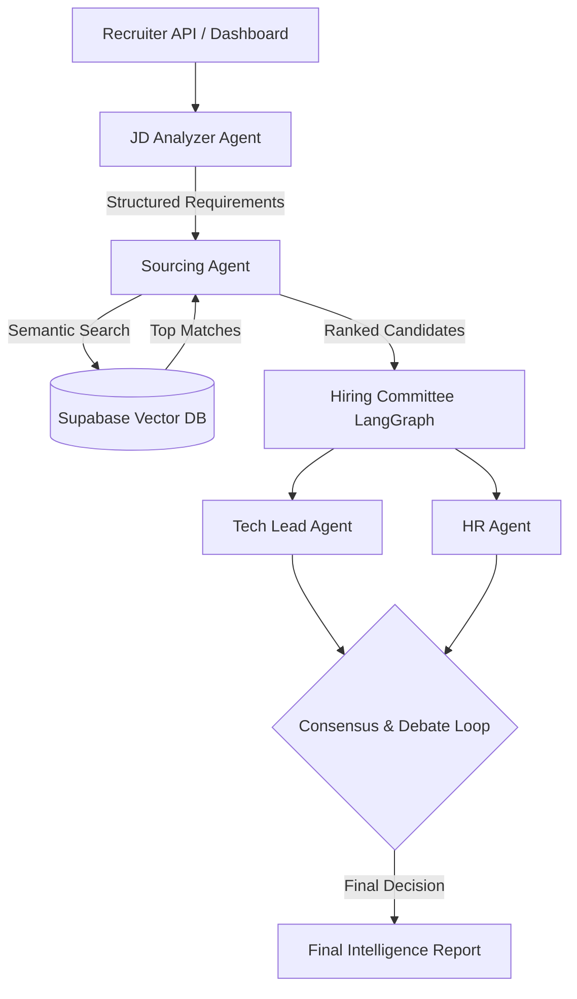

# TalentStream AI 🚀

**Autonomous Multi-Agent Hiring & Interviewing System**

---

## 🔥 The Unique Positioning (Top 1% Strategy)
**TalentStream AI** is an autonomous recruitment ecosystem that simulates a **real-world hiring pipeline.** Instead of relying on a single model's output, it employs a **"Digital Hiring Committee"** of specialized AI agents that collaborate, debate, and reason together to move a candidate from application to a final data-driven hiring decision.

### Week 5 Milestone: The Agentic Shift (LangGraph Implementation)
For the Week 5 milestone, we have transitioned from a linear pipeline to a **Multi-Agent Decision Loop** using **LangGraph**. The system now implements the "Digital Hiring Committee" where specialized agents (e.g., Tech, HR, Manager) collaborate, debate candidate fit based on gaps and strengths, and use stateful orchestration to arrive at a consensus-driven final decision.

---

## 🧪 Week 5 Milestone: End-to-End Consensus Demo

The system generates a comprehensive **Talent Intelligence Report** after a multi-agent debate:

```text
━━━━━━━━━━━━━━━━━━━━━━━━━━━━━━━━━━━━━━━━━━━━━━━━━━━━━━━━━━━━━━━
           TALENT INTELLIGENCE REPORT - HIRING COMMITTEE
━━━━━━━━━━━━━━━━━━━━━━━━━━━━━━━━━━━━━━━━━━━━━━━━━━━━━━━━━━━━━━━
CANDIDATE: Jane Doe
CONSENSUS SCORE: 92%

🤝 COMMITTEE DEBATE SUMMARY:
  ● Tech Lead Agent: "Strong technical foundations in FastAPI and React. Can handle scaling our RAG systems."
  ● HR Manager Agent: "Great cultural fit and communication skills, though we need to assess her handling of ambiguous LLM errors."
  ● Decision: Unanimous agreement to proceed.

🎯 STRATEGIC INTERVIEW QUESTIONS:
  1. Describe a recent project where you had to optimize the performance of a React application. What specific optimizations did you implement?
  2. How do you handle errors and exceptions when integrating with Large Language Models (LLMs)?
  3. Design a high-level architecture for a scalable web application that utilizes LLMs.

💡 INTERVIEWER GUIDANCE:
  Validate technical depth during system design questions to confirm her level 3 competency in LangGraph.
━━━━━━━━━━━━━━━━━━━━━━━━━━━━━━━━━━━━━━━━━━━━━━━━━━━━━━━━━━━━━━━
FINAL RECOMMENDATION: HIRE / PROCEED (CONSENSUS REACHED)
━━━━━━━━━━━━━━━━━━━━━━━━━━━━━━━━━━━━━━━━━━━━━━━━━━━━━━━━━━━━━━━
```

---

## 🧠 System Architecture

The system fundamentally shifted to a **Stateful Orchestrated Agentic Workflow** utilizing LangGraph.



### The Pipeline:
1.  **JD Analyzer Agent**: Extracts structured requirements from raw job descriptions.
2.  **Sourcing Agent**: Performs semantic search across the **Vector DB** to find best-fit talent.
3.  **Hiring Committee (LangGraph)**: Replaces the linear screener. Tech and HR agents review the candidate in parallel, debate discrepancies, and reach a consensus score.
4.  **Interviewer Agent**: Generates strategic, non-googlable questions based on the committee's findings.

---

## 🧩 Project Structure
- `agents/`: Core logic for specialized AI agents (including the new LangGraph committee nodes).
- `api/`: FastAPI backend implementation and REST endpoints.
- `ingest_resumes.py`: Utility to parse and index resumes into the Vector DB.
- `main.py`: CLI entry point for the Multi-Agent Debate Demo.

## 🛠️ Tech Stack
- **Orchestration**: LangGraph (Week 5 Upgrade) & CrewAI
- **LLMs**: Gemini 1.5 Pro & Groq (Llama 3)
- **Embeddings**: HuggingFace Local (Free & Private)
- **Database**: PostgreSQL + pgvector (Supabase)

## 🚀 Getting Started (Week 5 Milestone)

### 1. Run the Hiring Committee Demo (CLI)
```bash
python main.py
```

### 2. Run the Evaluation API
```bash
uvicorn api.main:app --reload
```
Test the multi-agent consensus logic via the backend endpoints.
