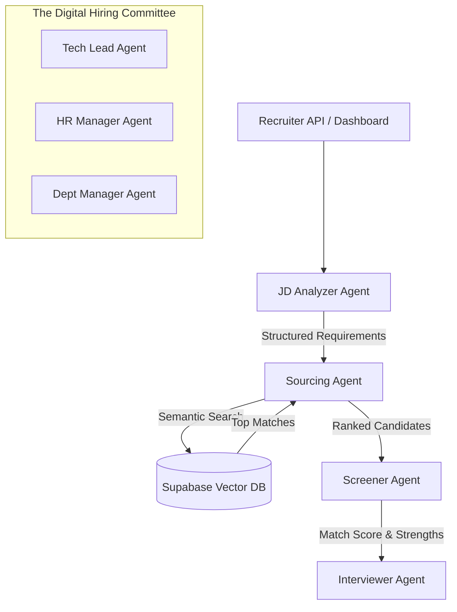

# TalentStream AI 🚀

**Autonomous Multi-Agent Hiring & Interviewing System**

---

## 🔥 The Unique Positioning (Top 1% Strategy)
**TalentStream AI** is an autonomous recruitment ecosystem that simulates a **real-world hiring pipeline.** Instead of relying on a single model's output, it employs a **"Digital Hiring Committee"** of specialized AI agents that collaborate, debate, and reason together to move a candidate from application to a final data-driven hiring decision.

### Week 3 Milestone: Semantic Sourcing & Vector DB
For the Week 3 milestone, we have moved from static file screening to a **stateful, searchable talent database.** The system now features:
1.  **Vector Search (pgvector):** High-performance semantic search powered by Supabase and local embeddings (HuggingFace).
2.  **Sourcing Agent (The Headhunter):** A dedicated agent that translates JDs into search strategies to find the top matching candidates in the database.
3.  **RAG Pipeline:** Automated ingestion and embedding of resumes into a persistent "Long-term Memory."

---

## 🧪 Week 3 Milestone: Sourcing Agent Demo

The system can now source candidates semantically from thousands of records:

```text
━━━━━━━━━━━━━━━━━━━━━━━━━━━━━━━━━━━━━━━━━━━━━━━━━━━━━━━━━━━━
           TALENT INTELLIGENCE REPORT - SOURCING
━━━━━━━━━━━━━━━━━━━━━━━━━━━━━━━━━━━━━━━━━━━━━━━━━━━━━━━━━━━━
TARGET ROLE: Senior Full-Stack Engineer (AI focus)

1. Jane Doe
   Similarity Score: 0.89
   Headhunter Reasoning: Jane is an elite match with 8+ years of experience and specific expertise in LLM production workflows and RAG systems, perfectly aligning with the AI focus of this role.

2. John Smith
   Similarity Score: 0.72
   Headhunter Reasoning: Strong backend fundamentals in Python/Django, though lacks the direct AI integration experience required for the primary focus of this position.
━━━━━━━━━━━━━━━━━━━━━━━━━━━━━━━━━━━━━━━━━━━━━━━━━━━━━━━━━━━━
```

---

## 🧠 System Architecture

The system operates on an **Orchestrated Agentic Workflow** using CrewAI and LangGraph.



### The Pipeline:
1.  **JD Analyzer Agent**: Extracts structured requirements from raw job descriptions.
2.  **Sourcing Agent**: Performs semantic search across the **Vector DB** to find best-fit talent.
3.  **Screening Agent**: Performs a "Deep Match" between requirements and specific candidate experience.
4.  **Consensus Engine**: Agents resolve conflicts and output a synthesized "Talent Report."

---

## 🧩 Project Structure
- `agents/`: Core logic for specialized AI agents (`jd_analyzer_agent.py`, `screener_agent.py`, `sourcing_agent.py`).
- `api/`: FastAPI backend implementation and REST endpoints.
- `ingest_resumes.py`: Utility to parse and index resumes into the Vector DB.
- `data/Samples/`: Sample JDs and Resumes for testing.
- `docs/`: Personas, technical diagrams, and project documentation.

## 🛠️ Tech Stack
- **Orchestration**: CrewAI / LangGraph
- **LLMs**: Gemini 1.5 Pro & Groq (Llama 3)
- **Embeddings**: HuggingFace Local (Free & Private)
- **Database**: PostgreSQL + pgvector (Supabase)

## 🚀 Getting Started (Week 3 Milestone)

### 1. Ingest Resumes into Vector DB
```bash
python ingest_resumes.py
```

### 2. Run the Sourcing Test
```bash
python test_sourcing.py
```

### 3. Run the FastAPI Server
```bash
uvicorn api.main:app --reload
```
Once the server is running, you can access the **Interactive API Documentation (Swagger UI)** by navigating to the `/docs` endpoint on your local host to explore and test the REST endpoints, including the new `POST /source-candidates`.
