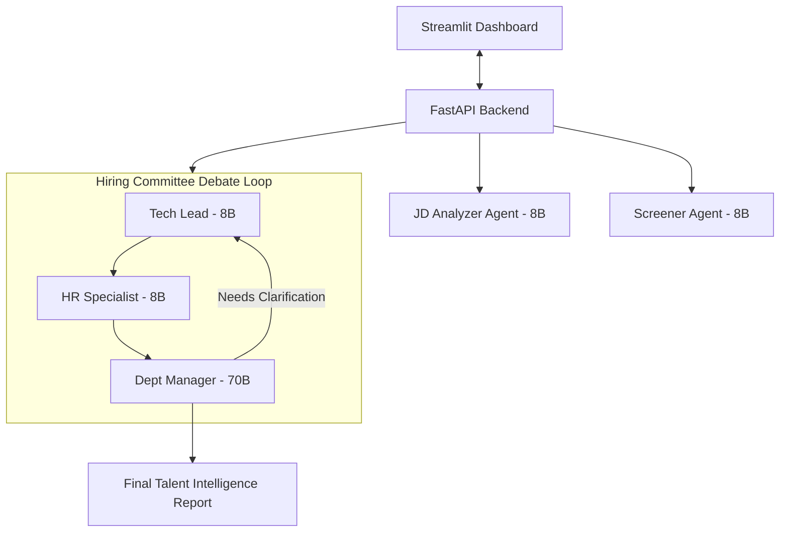

# TalentStream AI 🚀

**Autonomous Multi-Agent Hiring & Interviewing System**

---

## 🔥 The Unique Positioning (Top 1% Strategy)
**TalentStream AI** is an autonomous recruitment ecosystem that simulates a **real-world hiring pipeline.** Instead of relying on a single model's output, it employs a **"Digital Hiring Committee"** of specialized AI agents that collaborate, debate, and reason together to move a candidate from application to a final data-driven hiring decision.

### Week 6 Milestone: The Demo-Ready Interface (Streamlit & Cyclic LangGraph)
For the Week 6 milestone, we have evolved the system into a full-stack product. Key upgrades include:
1. **Streamlit Recruiter Dashboard**: A professional UI for JD analysis, resume uploads, and real-time debate visualization.
2. **Cyclic Hiring Committee**: Upgraded the LangGraph orchestration to support **Multi-Round Debates**, where agents loop until a consensus is reached (monitored by a Department Manager).
3. **Human-in-the-Loop (HITL)**: Recruiters can now provide "nudges" or constraints to the agents mid-workflow.
4. **Heterogeneous Model Strategy**: Optimized token usage and bypassed Groq rate limits by utilizing Llama-3.1-8B for worker agents and Llama-3.3-70B for the final managerial decision.

---

## 🏛️ Week 7 Milestone: Simulated Interview & Final Polish

The system now encompasses a complete end-to-end pipeline, culminating in an interactive candidate experience:

- **📄 Upload & Analyze**: Recruiters paste a JD and upload a PDF resume.
- **🏛️ Hiring Committee**: A visual display of the multi-round debate between the **Tech Lead**, **HR Specialist**, and **Department Manager**.
- **📊 Talent Intelligence Report**: A final synthesis featuring match scores, strengths, and strategic interview questions.
- **🎤 Simulated Interview**: A newly added interactive tab where candidates can practice answering the strategic questions and receive real-time, constructive feedback from the AI Interviewer Agent.

---

## 🧠 System Architecture

The architecture has evolved into a **Cyclic Agentic Workflow** with a professional frontend layer.


```mermaid
graph TD
    UI[Streamlit Dashboard] <--> API[FastAPI Backend]
    API --> JD[JD Analyzer Agent - 8B]
    API --> SCR[Screener Agent - 8B]
    API --> HG[Hiring Committee LangGraph]
    
    subgraph HG [Hiring Committee Debate Loop]
        TL[Tech Lead - 8B] --> HR[HR Specialist - 8B]
        HR --> DM[Dept Manager - 70B]
        DM -- "Needs Clarification" --> TL
    end
    
    DM --> REP[Final Talent Intelligence Report]
```

---

## 🛠️ Tech Stack
- **Frontend**: Streamlit (Week 6)
- **Backend**: FastAPI (Week 6)
- **Orchestration**: LangGraph (Cyclic) & CrewAI
- **LLMs**: Groq (Llama 3.1 8B & 3.3 70B)
- **Database**: PostgreSQL + pgvector (Supabase)
- **Deployment**: Render (Configured via `render.yaml`)

## 🚀 Getting Started

### 1. Installation
```bash
pip install -r requirements.txt
```

### 2. Launch the Full-Stack Demo
Start the backend:
```bash
uvicorn api.main:app --host 0.0.0.0 --port 8000
```

Start the frontend:
```bash
streamlit run app.py
```

### 3. Deployment
The project is configured for **Render**. Use the included `render.yaml` to deploy both services simultaneously.

---

## 🧩 Project Structure
- `agents/`: Core logic for specialized AI agents (Tech Lead, HR, Manager).
- `api/`: FastAPI backend with unified `/evaluate-candidate` endpoint.
- `app.py`: Streamlit frontend dashboard.
- `docs/STRATEGY.md`: The full 8-week execution roadmap and architecture decision records.
- `render.yaml`: Deployment configuration for multi-service cloud hosting.
