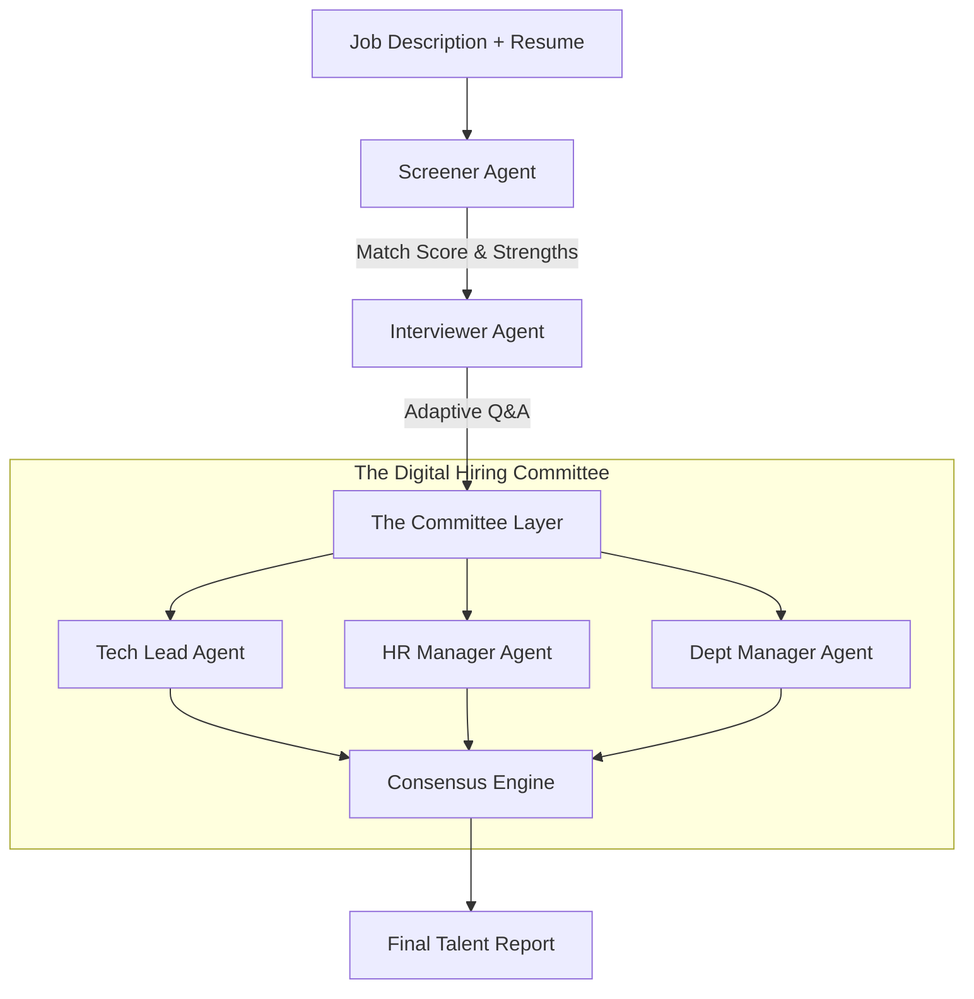

# TalentStream AI: System Architecture & Agentic Workflow 🏗️

This document details the architectural blueprint and the multi-agent orchestration that powers TalentStream AI.

---

## 🏛️ 1. Architecture Overview
TalentStream AI is built as an **Autonomous Pipeline** that moves a candidate through a simulated hiring funnel. Unlike traditional tools, it relies on the **Collective Intelligence** of specialized AI agents.

---

## ⚙️ 2. The Multi-Agent Workflow

### Phase I: The Digital Screener (Current Focus)
The **Screener Agent** performs a "Deep Match" between the candidate's profile and the Job Description. It identifies:
- **Technical Strengths:** Direct matches in skills and experience.
- **Critical Gaps:** Missing must-have requirements.
- **Probe Areas:** Specific "weak spots" or "ambiguities" that the next agent should investigate.

### Phase II: The Interactive Interviewer (Up Next)
The **Interviewer Agent** receives the "Probe Areas" and generates a dynamic set of questions. It isn't a fixed list; it's an **Adaptive Agent** that listens to answers and "digs deeper" if it detects a vague or LLM-generated response.

### Phase III: The Hiring Committee (The Debate)
The interview transcripts and initial screening reports are passed to three distinct personas:
- **Tech Lead Agent:** Focuses on architectural depth, technical logic, and hard skills.
- **HR Manager Agent:** Focuses on culture fit, soft skills, and potential burnout risks.
- **Dept Manager Agent:** Focuses on the ROI of the hire and long-term team balance.

### Phase IV: Consensus & Reporting
The final **Consensus Engine** facilitates a debate among the committee members to resolve conflicting opinions. The result is a comprehensive **Talent Intelligence Report** that provides a clear "Hire/No-Hire" recommendation backed by agentic reasoning.

---

## 🧠 3. Why Agentic Orchestration?
By using **Stateful Multi-Agent Orchestration (LangGraph)**, TalentStream AI avoids the bias and "hallucination drift" common in single-prompt AI systems. Each agent acts as a **Critic** for the others, ensuring the final decision is objective, data-driven, and highly reliable.
